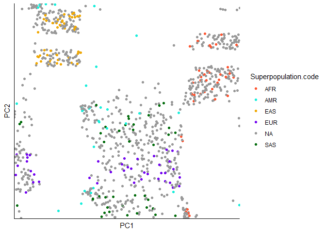
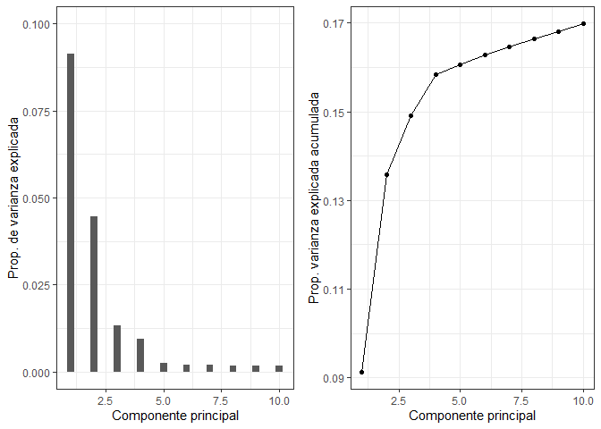
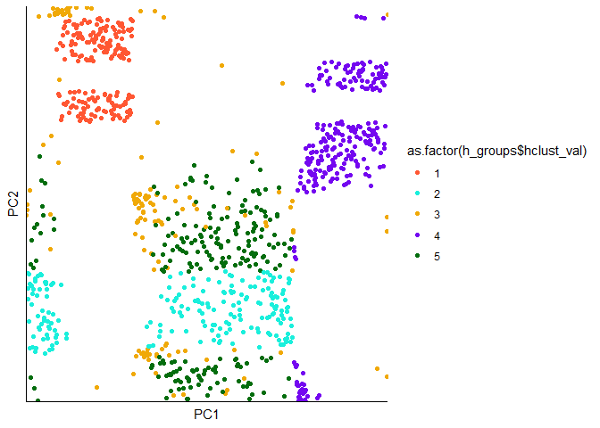
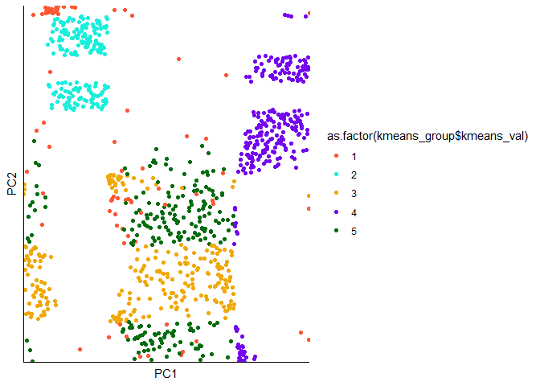
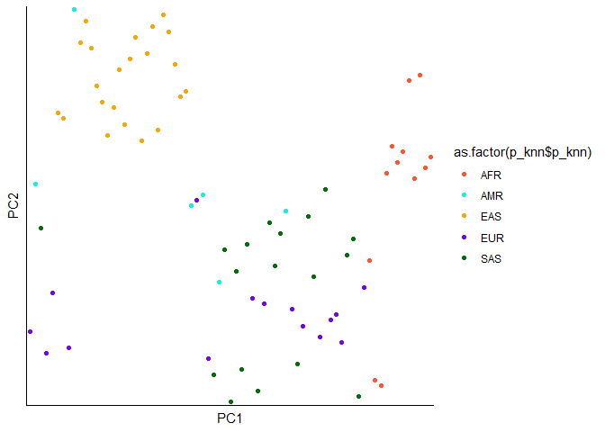
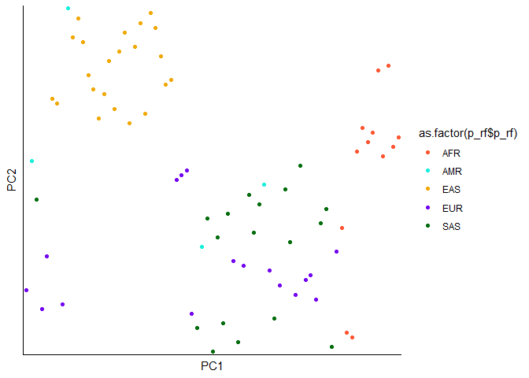
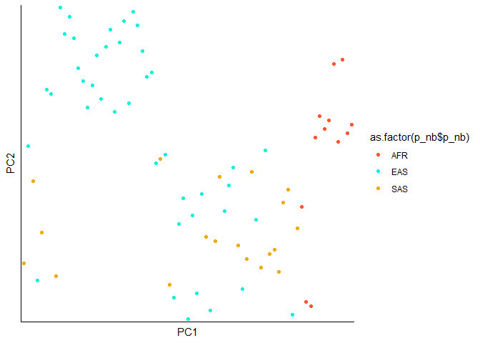

Amphora Code Challenge
================
SGD
2022-07-04

## Prerequisites

For run the code presented bellow you will need some packages already
installed in your system: caret class dplyr docstring ggplot2 gridExtra
naivebayes plotly poppr randomForest scorecard

## Task 1: Merge multiple files into a single table

For the first task in the challenge we use R to merge multiple genotype
files in different format (VCF and CSV) from the Challenge samples
folder into one large genotype table.

For this first task you need the library **dplyr** installed and also
you had to specify your working directory and have a folder with all the
samples that we will merge. In this case my working directory is
**“D:/Users/Zalva/OneDrive/Amphora/final”** and my samples are stored in
**“Challenge samples/”**

``` r
### Indicate working directory
### this should include a folder called "Challenge samples" and
### a coordination.txt  file
wd <- "D:/Users/Zalva/OneDrive/Amphora/final"
samples_folder <- "Challenge samples/"

### Include new SNPs that are added at the end of the genotype table
### In case you leave this flag as *FALSE* the script will use the SNP
### founds in the first sample as base and new varians found in subsequent
### files will be discarded.
add_new <- FALSE


### if save_table set as TRUE and table_file is a filename
### then a CSV file with the genotype table will be saved
save_table <- TRUE
table_file <- "geno_table.csv"
```

You also have some flags and options here. **add_new** flag indicate if
new SNPs will be added to the table as they are found in the files
(**TRUE**). In case you leave this flag as **FALSE** the script will use
the SNP founds in the first sample as base and new varians found in
subsequent files will be discarded. Disable this option helps to reduce
the NAs stored in the table. **save_table** flag and **table_file** are
used to specify if the resulting genotype table is saved and the file
name that it will be used. Remember that the table will be a comma
separated file (CSV).

Next we define the custom functions that we will use.

The first one it will help us to import genotype tables from VCF or CSV
files and standardize the format that we will use. Only uses one
argument that correspond to the file name that will be processed.

``` r
import_geno <- function(file){
  #' Import genotype function
  #'
  #' This function reads a CSV or VCF file from one individual sample
  #' and import the content as a data frame.
  #'
  #' VCF files should include ten columns: "CHROM", "POS", "ID", "REF",
  #' "ALT", "QUAL","FILTER", "INFO", "FORMAT", "individual genotye"
  #' CSV files should include five columns: "CHROM;POS", "REF",
  #' "ALT", "ALT.1",    "individual genotye"
  #'
  #'@param file input file to be processed. Could be either a CSV or a VCF

  ind <- gsub("\\..*","",basename(file))
  ### check file type and read table
  ### check if file is vcf
  if(grepl(".vcf", file, fixed=TRUE)){
    filetype <- "vcf"
    ### read vcf tables
    t <- read.table(file)
    ### check if vcf file have the expected format
    if(dim(t)[2] != 10){
      cat("WARNING \n
      The number of columns in the VCF file does not match
            what is expected (10).\n
          Please check the format\n
          file", file, "will NOT be included")
    } else {
      ### set col names
      colnames(t) <-  c("CHROM", "POS", "ID", "REF", "ALT", "QUAL",
                        "FILTER", "INFO", "FORMAT", ind)
      t$CHROM <- as.character(t$CHROM)
      t$POS <- as.character(t$POS)
    }
    
    return(t[,c("CHROM", "POS", "ID", "REF", "ALT", ind)])
    ### check if file is csv
  } else if(grepl(".csv", file, fixed=TRUE)){
    filetype <- "csv"
    ### read csv tables
    t <- read.csv(file, head=TRUE)
    ### check if csv file have the expected format
    if(dim(t)[2] != 5){
      cat("WARNING \n
      The number of columns in the CSV file does not match
            what is expected (5).\n
          Please check the format\n
          file", file, "will NOT be included")
    } else {
      ### make new data frame
      t <- data.frame(CHROM=as.character(sub(";.*", "", t[[1]])),
                      POS=as.character(sub(".*;", "", t[[1]])),
                      ID="",
                      REF=t$REF,
                      ALT=t$ALT,
                      ind=sub(",", "|", t[[5]], fixed=TRUE))
      ### set colnames
      colnames(t) <- c("CHROM", "POS", "ID", "REF", "ALT", ind)
      
      
    }
    return(t)
  } else {
    cat("file is different format that expected (VCF/CSV)")
  }
}
```

The second one transforms a vector from the genotype format to values of
0, 1 and 2. 0 indicate that the individual is homozygous for the
reference allele in that locus. 1 indicate that he is heterozygous. And
2 is for homozygous for the alternative allele.

``` r
geno2num <- function(genotype){
  #' Genotype to numeric function
  #'
  #' Turn a vector of genotype format values (0|0)
  #' into a vector of numeric factors (1,2,3)
  #' 
  #' Values of 0|0 are homozygous for the reference allele and are converted to 0
  #' Values of 0|1 or 1|0 are heterozygous and are converted to 1
  #' Values of 1|1 are homozygous for the alternative allele and are converted to 2
  #'
  #'@param  genotype Vector of genotype values
  #'

  ### turn genotype to numeric factors (0,1,2)
  ### homozygous for reference
  geno_num <- gsub("0|0", "0",  genotype, fixed=TRUE)
  ### heterozygous
  geno_num <- gsub("0|1", "1",  geno_num, fixed=TRUE)
  geno_num <- gsub("1|0", "1",  geno_num, fixed=TRUE)
  ### homozygous for varian
  geno_num <- gsub("1|1", "2",  geno_num, fixed=TRUE)
  return(as.factor(as.numeric(geno_num)))
}
```

The third function uses three argument and merge two genotype tables.
The first argument is the first genotype table. This table is used as
base for the merge and the values of “CHROM”, “POS”, “ID”, “REF”, “ALT”
will be conserved. The second argument is the second table and the third
argument is **add_new** flag. Variants present in both tables are merge
together. The variants present in the first table but no in the second
one are conserved and the absences are marked as NA. If **add_new** was
set as **FALSE** then the varians present in the second table but absent
from the first one are discarded. However, if **add_new** is set as
**TRUE** then the SNP present in the second table but no in the first
one are added as new rows in the resulting table and the absences are
marked as NA. Use **add_new == TRUE** could lead to an high number of
NAs, however is useful to list all the variants present in all the
files.

``` r
join_geno <- function(base, geno_table, add_new){
  #' Join two genotype tables
  #' 
  #' This function merge two genotype data frames into one new data frame
  #' 
  #' The first data frame is used as base. All the variants and genotypes
  #' present in this data frame will be conserved. 
  #' The second data frame is added to the base. Variants presented in 
  #' both data frames are conserved. If add_new flag is set as TRUE
  #' Variants present in this data frame but absent in the base are
  #' conserved and added at the end of the data. If add_new flag is set as
  #' FALSE then variants present in this data frame but absent in the base are
  #' discarded. All the missing variants of each individual are filled with NA
  #' The first 5 columns of both data frames should be named as follows:
  #' "CHROM", "POS", "ID", "REF", "ALT"
  #' REQUIRES dplyr
  #' 
  #' @param base genotype dataframe used as base
  #' @param geno_table genotype dataframe added to the base
  #' @param add_new If TRUE: new variants are added at the end of the data frame
  #'
  #' 
  
  if(all(colnames(geno_table)[1:5] == c("CHROM", "POS", "ID", "REF", "ALT")) &
     all(colnames(base)[1:5] == c("CHROM", "POS", "ID", "REF", "ALT"))){
    if(add_new == TRUE){
      t <- dplyr::full_join(base, geno_table[,c(1,2,4,5,6)],
                            by=c("CHROM", "POS", "REF", "ALT"))
    } else {
      t <- dplyr::left_join(base, geno_table[,c(1,2,4,5,6)],
                            by=c("CHROM", "POS", "REF", "ALT"))
    }
    return(t)
  } else { 
    cat("column names dont match to expected format\n
    columns should be as follows:\n
    CHROM, POS, ID, REF, ALT genotypes... ")
  }
}
```

We use these functions to perform the merging of the files in the
samples folder. We first list all the files stored there and then
iterate through all the individuals using a for loop.

``` r
############################################################
########################## START ###########################
############################################################
### set working directory
setwd(wd)

### list samples in samples folder
files <- list.files(samples_folder)

############################################################
####################### read tables ########################
############################################################

for(i in 1:length(files)){
  file <- paste("Challenge samples/", files[i], sep="")
  if(i == 1){
    base_geno <- import_geno(file)
    base_geno[[6]] <- geno2num(base_geno[[6]])
  } else {
    geno_table <- import_geno(file)
    geno_table[[6]] <- geno2num(geno_table[[6]])
    base_geno <- join_geno(base_geno, geno_table, add_new)
  }
}
```

Then we export the resulting table as a CSV file.

``` r
############################################################
######################## save file #########################
############################################################
if(save_table == TRUE){
  write.csv(base_geno, table_file, row.names=FALSE)
}
```

The resulting table consists of 5 columns with information for each SNP
(“CHROM”, “POS”, “ID”, “REF”, “ALT”). The following columns are the
genotype presented in each individual.

    ##   CHROM     POS          ID REF ALT 00010525-252c-5335-9724-0c191b5ece1b
    ## 1     5  195139 rs118046653   C   T                                    0
    ## 2     5  336952   rs4957023   T   C                                    1
    ## 3     5  389603   rs6555227   T   C                                    2
    ## 4     5  851582   rs3810859   G   A                                    0
    ## 5     5 1144802   rs6899170   T   C                                    2
    ##   004302a4-6871-55e2-945b-3a46b9236f22
    ## 1                                    0
    ## 2                                    2
    ## 3                                    0
    ## 4                                    1
    ## 5                                    1

## Task 2: Perform clustering and visualyze

### Task 2.1 Visualize data

For the second task we will need another custom function. This load the
CSV file that we created in the previous task and give it the required
format.

``` r
### Indicate working directory
### this should include a folder called "Challenge samples" and
### a coordination.txt  file
wd <- "D:/Users/Zalva/OneDrive/Amphora/final"
samples_folder <- "Challenge samples/"
coord_file <- "coordination.txt"

### Indicate the name of the genotype table file
table_file <- "geno_table.csv"

### if you want to omit an individual indicate their UUID
### else, set as FALSE.
### recomended for samples with high number of NAs
omit_ind <- "0abbd799-8737-54f5-b587-7bea7100a61f"

### indicate if you want to extract the SNPs whit the highest 
### contribution to the PCAs and how many PCAs you want to consider for this.
### recommended to run first the PCA analysis before modify this
identify_SNP <- TRUE
number_PC <- 4

### if you want to extract the SNPs whit the highest 
### contribution to the PCAs and save it as a different genotype
###table set this as TRUE and indicate a filename
save_selected <- TRUE
selected_file <- "geno_selected.csv"

############################################################
##################### DEFINE FUNCTIONS #####################
############################################################ 
load_geno <- function(file, format, omitted = FALSE){
  #' Load genotype tables
  #' 
  #' read a genotype table from a CSV file and turn it to a matrix
  #' 
  #' This function reads a CSV file to load a genotype table and 
  #' return a matrix in different formats:\n
  #' "ind_as_col": each column is an individual genotype
  #' and the rows represent the different loci\n
  #' "snp_as_col": each column is a locus 
  #' and the rows represent each individual genotype\n
  #' "gwas": genotype table required by the GWAS function 
  #' from the rrBLUP package
  #' 
  #' @param file genotype table stored as CSV file
  #' @param format format to return the output data frame (see details)
  #' @omitted character vector of omitted individuals.
  #' 
  #' 
  ### load geno table file
  data <- read.csv(file)
  ### change rownames and colnames
  rownames(data) <- paste(data$CHROM, ";", data$POS, ";",
                          data$REF, ";", data$ALT, sep="")
  colnames(data) <- gsub(".", "-", colnames(data), fixed=T)
  colnames(data) <- gsub("X", "", colnames(data), fixed=T)
  
  ### remove omitted individuals
  if(length(omitted) != FALSE){
    data <- data[,!names(data) %in% omit_ind]
  }
  if(format == "ind_as_col"){
    ### remove SNPs with NAs
    return(t(data[complete.cases(data),6:dim(data)[2]]))
  } else if(format == "snp_as_col"){
    return(data[complete.cases(data),6:dim(data)[2]])
  } else if(format == "gwas"){
    gwas_data <- data.frame(marker = data$ID,
                            chrom =as.numeric(data$CHROM),
                            pos = as.numeric(data$POS))
    gwas_data <- cbind(gwas_data, data[6:ncol(data)])
    return(gwas_data)
  }
}
```

Aditionally we need our coordination file and a vector with the colors
that we will use in the plots.

``` r
############################################################
########################## START ###########################
############################################################
### set working directory
setwd(wd)

### set colors for plots
colors <- c("#ff5733", "#1aefdc", "#f0a907", "#7407f0", "#999999", "#046d0e")

### read coordination file
coord <- read.table(coord_file, header = TRUE, sep="\t")

### load genotype table
data_pca <- load_geno(table_file, "ind_as_col", omitted=omit_ind)
```

Once we load the genotype table in the correct format we can perform a
PCA using **prcomp**. From the results of this we will extract the PCA
values and join those to the superpopulation code from the coordination
file

``` r
# ### compute PCA and extract PCA values
pca <- prcomp(data_pca)
pca_vals <- pca$x

### add UUID and Superpopulation code
pca_vals <- cbind(rownames(pca_vals), pca_vals)
colnames(pca_vals)[1] <- "UUID"
pca_vals <- dplyr::left_join(as.data.frame(pca_vals), coord, by="UUID")
pca_vals$Superpopulation.code[is.na(pca_vals$Superpopulation.code)] <- "NA"
### save for future plots
write.csv(pca_vals, "pca_vals.csv")
```

Then we can make the scatter plot to visualize the data points using the
PCA values.

``` r
### plot pca using ggplot
ggplot2::ggplot(pca_vals, 
  ggplot2::aes(x=PC1, y=PC2, color=Superpopulation.code)) +
  ggplot2::geom_point() +
  ggplot2::labs(x="PC1", y="PC2") +
  ggplot2::theme_classic() +
  ggplot2::theme(axis.text.x=ggplot2::element_blank(),
        axis.ticks=ggplot2::element_blank(),
        axis.text.y=ggplot2::element_blank()) +
  ggplot2::scale_color_manual(values=colors)
```

<!-- -->

``` r
# ### plot pca using plotly (3D)
# plotly::plot_ly(x=pca_vals$PC1, y = pca_vals$PC2, z = pca_vals$PC3, 
#         type="scatter3d", mode = "markers",
#         color=pca_vals$Superpopulation.code,
#         colors=colors)
```

Here we can see that the data points appear to form clusters. The
labeled data are grouped together and we can begin to guess the
membership of some unlabeled individuals.

Also we can see the Variance explained by each PC and the cumulative
variance. In this case the first two PC explain more of the variance,
then the third and fourth also contribute with an important amount and
the rest of the PC have an smaller effect.

``` r
### plot PCA varianza explained
prop_varianza <- pca$sdev^2 / sum(pca$sdev^2)
PCA_var <- ggplot2::ggplot(data = data.frame(prop_varianza[1:10], pc = 1:10),
  ggplot2::aes(x = pc, y = prop_varianza[1:10])) +
  ggplot2::geom_col(width = 0.3) +
  ggplot2::scale_y_continuous(limits = c(0,0.1)) +
  ggplot2::theme_bw() +
  ggplot2::labs(x = "Componente principal",
                y = "Prop. de varianza explicada")

### plot PCA cumulative variance
prop_varianza_acum <- cumsum(prop_varianza)
PCA_acum_var <- ggplot2::ggplot(data = data.frame(prop_varianza_acum[1:10], pc = 1:10),
  ggplot2::aes(x = pc, y = prop_varianza_acum[1:10], group = 1)) +
  ggplot2::geom_point() +
  ggplot2::geom_line() +
  ggplot2::theme_bw() +
  ggplot2::labs(x = "Componente principal",
                y = "Prop. varianza explicada acumulada")

gridExtra::grid.arrange(PCA_var, PCA_acum_var, ncol=2)
```

<!-- -->

If we want to find which SNPs are the ones that contribute the more to
the first PCs we can use the flag **identify_SNP** for extract and save
those SNPs in a new genotype CSV.

### 2.2 Clustering (unsupervised)

To obtain the membership of the data we can start to cluster the
individuals using some unsupervised methods.

The first approach is a hierarchical clustering method. In this case we
will import our genotype table and compute the Nei’s distance from the
package **poppr**. The we use the distance matrix generated for run the
function **hclust()** to compute the clusters. Here we are using the
Nei’s distance and the method “ward.D2” as this are the one that showed
the best results in our tests. However you can experiment with other
methods and distances.

After we have our analysis done we can use the function **cutree()**
with k = 5 to identify the clusters to which each sampled belongs. We
are using k = 5 because we aknow *a priori* that we have five different
superpopulations in our data set. Finally we can plot our clustering
results in the same scatter plot than before.

``` r
############################################################
################# hierarchical clustering ##################
############################################################
### load data for hierarchical clustering
data_clust <- load_geno(table_file, "ind_as_col", omitted=omit_ind)

### compute Nei's distance
data_dis <- poppr::nei.dist(data_clust)

### perform hierarchical clustering and split in 5 clusters
h_clust <- hclust(data_dis, method = "ward.D2")
h_groups <- data.frame(hclust_val = cutree(h_clust, k=5))
h_groups$UUID <- rownames(h_groups)

###################### Plot figures ########################
### plot pca using ggplot
ggplot2::ggplot(pca_vals,
  ggplot2::aes(x=PC1, y=PC2, color=as.factor(h_groups$hclust_val))) +
  ggplot2::geom_point() +
  ggplot2::labs(x="PC1", y="PC2") +
  ggplot2::theme_classic() +
  ggplot2::theme(axis.text.x=ggplot2::element_blank(),
        axis.ticks=ggplot2::element_blank(),
        axis.text.y=ggplot2::element_blank()) +
  ggplot2::scale_color_manual(values=colors[c(1,2,3,4,6)])
```

<!-- -->

Our second approach will be a K-means clustering method. For this again
we import our genotype table. Here we use the function **kmeans()** for
the analysis. We set 5 centers based on the five groups that we know we
have in our data set. Finally we visualize the results.

``` r
############################################################
#################### kmeans clustering #####################
############################################################
### load data for kmeans clustering
data_kmeans <- load_geno(table_file, "ind_as_col", omitted=omit_ind)
### perform kmeans clusterin for 5 clusters
kmeans <- kmeans(data_kmeans, centers=5, iter.max = 1000, nstart = 10)
kmeans_group <- data.frame(kmeans_val = kmeans$cluster)
kmeans_group$UUID <- rownames(kmeans_group)

###################### Plot figures ########################
### plot pca using ggplot
ggplot2::ggplot(pca_vals,
                ggplot2::aes(x=PC1, y=PC2, color=as.factor(kmeans_group$kmeans_val))) +
  ggplot2::geom_point() +
  ggplot2::labs(x="PC1", y="PC2") +
  ggplot2::theme_classic() +
  ggplot2::theme(axis.text.x=ggplot2::element_blank(),
                 axis.ticks=ggplot2::element_blank(),
                 axis.text.y=ggplot2::element_blank()) +
  ggplot2::scale_color_manual(values=colors[c(1,2,3,4,6)])
```

<!-- -->

The evaluation of the clustering will be made at the end but in the mean
time we can store our results in a data matrix. We only have to change
the numbers assigned at each cluster by the analysis for the
superpopulation codes that we use. We make this change based on our
previous knowledge of the data set.

``` r
results <- data.frame(UUID = coord$UUID,
                      True_val = coord$Superpopulation.code)
results <- dplyr::left_join(results, h_groups, by = "UUID")
results <- dplyr::left_join(results, kmeans_group, by = "UUID")
rownames(results) <- results$UUID

### set groups names based on original data
### for AFR
results$hclust_val[results$hclust_val == results["cfd8c6f1-5e09-5589-92de-67560eb0acb8",3]] <- "AFR"
results$kmeans_val[results$kmeans_val == results["cfd8c6f1-5e09-5589-92de-67560eb0acb8",4]] <- "AFR"

### for AMR
results$hclust_val[results$hclust_val == results["416db4f1-9443-594e-a4b7-bccc5ba59b02",3]] <- "AMR"
results$kmeans_val[results$kmeans_val == results["416db4f1-9443-594e-a4b7-bccc5ba59b02",4]] <- "AMR"

### for EAS
results$hclust_val[results$hclust_val == results["8eb7539a-9b7d-580c-bb32-d940441fcbdc",3]] <- "EAS"
results$kmeans_val[results$kmeans_val == results["8eb7539a-9b7d-580c-bb32-d940441fcbdc",4]] <- "EAS"

### for EUR
results$hclust_val[results$hclust_val == results["75240c09-57b6-5579-bb62-0cc50247dae2",3]] <- "EUR"
results$kmeans_val[results$kmeans_val == results["75240c09-57b6-5579-bb62-0cc50247dae2",4]] <- "EUR"

### for SAS
results$hclust_val[results$hclust_val == results["e07cc175-dea0-5474-a2c9-e1b2cb34baf6",3]] <- "SAS"
results$kmeans_val[results$kmeans_val == results["e07cc175-dea0-5474-a2c9-e1b2cb34baf6",4]] <- "SAS"

### set as factor
results$True_val <- as.factor(results$True_val)
results$hclust_val <- as.factor(results$hclust_val)
results$kmeans_val <- as.factor(results$kmeans_val)
```

### 2.3 Classification (supervised)

In the previous secction we use unsupervised methods to perform the
clustering of the data. Those are specially useful for data where whe
dont now the correct assignment of the data points. However, we do know
the assignment of some of our data points. This allow us to use some
classification methods.

The first step to implement a classification function we need to split
our data set. We will extract the labeled data (those for what we have
the supepopulation of origin) and we split that data in our training and
test datasets.

``` r
### load genotype table and change rownames
data <- as.data.frame(load_geno(table_file, "ind_as_col", omitted=omit_ind))
colnames(data) <- paste("X", 
                        gsub(";", "_", colnames(data)), sep="")

### add superpopulation code
data$UUID <- rownames(data)
data <- dplyr::left_join(data, coord, by="UUID")
# data$UUID <- NULL

### extract labeled data and unlabeled
data_lab <- data[!is.na(data$Superpopulation.code),]
data_unlab <- data[is.na(data$Superpopulation.code),]
data_unlab$Superpopulation.code <- NULL

### split labeled data in train and test
data_sp <- scorecard::split_df(data_lab, ratio = 0.6, seed = 1234)

train <- data_sp$train; train[,c("UUID", "Superpopulation.code")] <- NULL
test <- data_sp$test; test[,c("UUID", "Superpopulation.code")] <- NULL
country_train <- as.factor(data_sp$train$Superpopulation.code)
country_test <- as.factor(data_sp$test$Superpopulation.code)
pca_test <- pca_vals[pca_vals$UUID %in% data_sp$test$UUID, ]
```

We will implement three different classifiers. First we use a k nearest
neighbor function, then a random forest algorithm and finally a naive
Bayes approach. Basically each require the training data set to
establish the model and then we use the test dataset to (obviously) test
the model. Finally we plot the test points.

``` r
############################################################
### K nearest neighbor classifier
knn <- class::knn(train = train,
                  test = test,
                  k = 1,
                  cl = country_train)
### predicted results for test data
p_knn <- data.frame(UUID = data_sp$test$UUID,
                    p_knn = knn)
### plot clustering
ggplot2::ggplot(pca_test, 
  ggplot2::aes(x=PC1, y=PC2, color=as.factor(p_knn$p_knn))) +
  ggplot2::geom_point() +
  ggplot2::labs(x="PC1", y="PC2") +
  ggplot2::theme_classic() +
  ggplot2::theme(axis.text.x=ggplot2::element_blank(),
                 axis.ticks=ggplot2::element_blank(),
                 axis.text.y=ggplot2::element_blank()) +
  ggplot2::scale_color_manual(values=colors[c(1,2,3,4,6)])
```

<!-- -->

``` r
############################################################
### random forest classifier
rf <- randomForest::randomForest(country_train~., 
                                 data=train)
### predicted results for test data
p_rf <- data.frame(UUID = data_sp$test$UUID,
                   p_rf = predict(rf, test))
### plot clustering
ggplot2::ggplot(pca_test, 
  ggplot2::aes(x=PC1, y=PC2, color=as.factor(p_rf$p_rf))) +
  ggplot2::geom_point() +
  ggplot2::labs(x="PC1", y="PC2") +
  ggplot2::theme_classic() +
  ggplot2::theme(axis.text.x=ggplot2::element_blank(),
                 axis.ticks=ggplot2::element_blank(),
                 axis.text.y=ggplot2::element_blank()) +
  ggplot2::scale_color_manual(values=colors[c(1,2,3,4,6)])
```

<!-- -->

``` r
############################################################
### naive bayes classifier
nb <- naivebayes::naive_bayes(country_train~., data=train)
### predicted results for test data
p_nb <- data.frame(UUID = data_sp$test$UUID,
                   p_nb = predict(nb, test))
### plot clustering
ggplot2::ggplot(pca_test, 
  ggplot2::aes(x=PC1, y=PC2, color=as.factor(p_nb$p_nb))) +
  ggplot2::geom_point() +
  ggplot2::labs(x="PC1", y="PC2") +
  ggplot2::theme_classic() +
  ggplot2::theme(axis.text.x=ggplot2::element_blank(),
                 axis.ticks=ggplot2::element_blank(),
                 axis.text.y=ggplot2::element_blank()) +
  ggplot2::scale_color_manual(values=colors[c(1,2,3,4,6)])
```

<!-- -->

## Task 3: evaluate clustering methods

Finaly as our last task we need to evaluate each of the clustering and
classification methods that we use.

We already make a data frame with the predicted cluster of each
unsupervised model. We can add the results for the supervised models.

``` r
results <- dplyr::left_join(results, p_knn, by = "UUID")
results <- dplyr::left_join(results, p_rf, by = "UUID")
results <- dplyr::left_join(results, p_nb, by = "UUID")
```

We can use the function **confusionMatrix** from the caret package to
calculate statistics of each of each model compared to the true
assigments.

``` r
cm_hclust <- caret::confusionMatrix(results$True_val, results$hclust_val)
cm_kmeans <- caret::confusionMatrix(results$True_val, results$kmeans_val)
cm_knn <- caret::confusionMatrix(results$True_val, results$p_knn)
cm_rf <- caret::confusionMatrix(results$True_val, results$p_rf)
cm_nb <- caret::confusionMatrix(results$True_val, results$p_nb)

### print result tables
t(cm_hclust$byClass)
```

    ##                      Class: AFR Class: AMR Class: EAS Class: EUR Class: SAS
    ## Sensitivity           1.0000000  1.0000000  1.0000000  0.9767442   1.000000
    ## Specificity           1.0000000  0.9940828  1.0000000  1.0000000   1.000000
    ## Pos Pred Value        1.0000000  0.9677419  1.0000000  1.0000000   1.000000
    ## Neg Pred Value        1.0000000  1.0000000  1.0000000  0.9936306   1.000000
    ## Precision             1.0000000  0.9677419  1.0000000  1.0000000   1.000000
    ## Recall                1.0000000  1.0000000  1.0000000  0.9767442   1.000000
    ## F1                    1.0000000  0.9836066  1.0000000  0.9882353   1.000000
    ## Prevalence            0.1959799  0.1507538  0.2361809  0.2160804   0.201005
    ## Detection Rate        0.1959799  0.1507538  0.2361809  0.2110553   0.201005
    ## Detection Prevalence  0.1959799  0.1557789  0.2361809  0.2110553   0.201005
    ## Balanced Accuracy     1.0000000  0.9970414  1.0000000  0.9883721   1.000000

``` r
t(cm_kmeans$byClass)
```

    ##                      Class: AFR Class: AMR Class: EAS Class: EUR Class: SAS
    ## Sensitivity           1.0000000 1.00000000  1.0000000  0.7500000   1.000000
    ## Specificity           1.0000000 0.92307692  1.0000000  1.0000000   1.000000
    ## Pos Pred Value        1.0000000 0.54838710  1.0000000  1.0000000   1.000000
    ## Neg Pred Value        1.0000000 1.00000000  1.0000000  0.9108280   1.000000
    ## Precision             1.0000000 0.54838710  1.0000000  1.0000000   1.000000
    ## Recall                1.0000000 1.00000000  1.0000000  0.7500000   1.000000
    ## F1                    1.0000000 0.70833333  1.0000000  0.8571429   1.000000
    ## Prevalence            0.1959799 0.08542714  0.2361809  0.2814070   0.201005
    ## Detection Rate        0.1959799 0.08542714  0.2361809  0.2110553   0.201005
    ## Detection Prevalence  0.1959799 0.15577889  0.2361809  0.2110553   0.201005
    ## Balanced Accuracy     1.0000000 0.96153846  1.0000000  0.8750000   1.000000

``` r
t(cm_knn$byClass)
```

    ##                      Class: AFR Class: AMR Class: EAS Class: EUR Class: SAS
    ## Sensitivity           1.0000000 1.00000000  1.0000000  0.8666667  1.0000000
    ## Specificity           1.0000000 0.97014925  1.0000000  1.0000000  1.0000000
    ## Pos Pred Value        1.0000000 0.75000000  1.0000000  1.0000000  1.0000000
    ## Neg Pred Value        1.0000000 1.00000000  1.0000000  0.9666667  1.0000000
    ## Precision             1.0000000 0.75000000  1.0000000  1.0000000  1.0000000
    ## Recall                1.0000000 1.00000000  1.0000000  0.8666667  1.0000000
    ## F1                    1.0000000 0.85714286  1.0000000  0.9285714  1.0000000
    ## Prevalence            0.1643836 0.08219178  0.3013699  0.2054795  0.2465753
    ## Detection Rate        0.1643836 0.08219178  0.3013699  0.1780822  0.2465753
    ## Detection Prevalence  0.1643836 0.10958904  0.3013699  0.1780822  0.2465753
    ## Balanced Accuracy     1.0000000 0.98507463  1.0000000  0.9333333  1.0000000

``` r
t(cm_rf$byClass)
```

    ##                      Class: AFR Class: AMR Class: EAS Class: EUR Class: SAS
    ## Sensitivity           1.0000000 1.00000000  1.0000000  0.7647059  1.0000000
    ## Specificity           1.0000000 0.94202899  1.0000000  1.0000000  1.0000000
    ## Pos Pred Value        1.0000000 0.50000000  1.0000000  1.0000000  1.0000000
    ## Neg Pred Value        1.0000000 1.00000000  1.0000000  0.9333333  1.0000000
    ## Precision             1.0000000 0.50000000  1.0000000  1.0000000  1.0000000
    ## Recall                1.0000000 1.00000000  1.0000000  0.7647059  1.0000000
    ## F1                    1.0000000 0.66666667  1.0000000  0.8666667  1.0000000
    ## Prevalence            0.1643836 0.05479452  0.3013699  0.2328767  0.2465753
    ## Detection Rate        0.1643836 0.05479452  0.3013699  0.1780822  0.2465753
    ## Detection Prevalence  0.1643836 0.10958904  0.3013699  0.1780822  0.2465753
    ## Balanced Accuracy     1.0000000 0.97101449  1.0000000  0.8823529  1.0000000

``` r
t(cm_nb$byClass)
```

    ##                      Class: AFR Class: AMR Class: EAS Class: EUR Class: SAS
    ## Sensitivity           1.0000000         NA  0.5238095         NA 0.26315789
    ## Specificity           1.0000000   0.890411  1.0000000  0.8219178 0.75925926
    ## Pos Pred Value        1.0000000         NA  1.0000000         NA 0.27777778
    ## Neg Pred Value        1.0000000         NA  0.6078431         NA 0.74545455
    ## Precision             1.0000000   0.000000  1.0000000  0.0000000 0.27777778
    ## Recall                1.0000000         NA  0.5238095         NA 0.26315789
    ## F1                    1.0000000         NA  0.6875000         NA 0.27027027
    ## Prevalence            0.1643836   0.000000  0.5753425  0.0000000 0.26027397
    ## Detection Rate        0.1643836   0.000000  0.3013699  0.0000000 0.06849315
    ## Detection Prevalence  0.1643836   0.109589  0.3013699  0.1780822 0.24657534
    ## Balanced Accuracy     1.0000000         NA  0.7619048         NA 0.51120858

Here we can see that each method make different clusters. Although in
general most methods performed well, the naive Bayes algorithm performed
the worst not being able of separate the members of AME, EUR and EAS.
